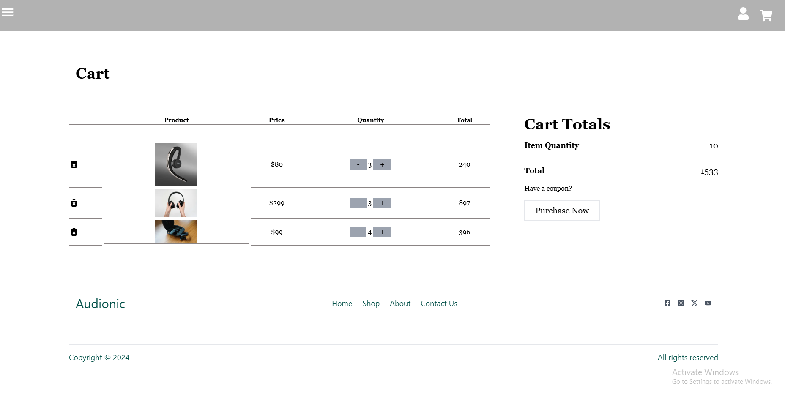

# The Headphone Store

Welcome to **The Headphone Store**, an online shop where you can browse and purchase high-quality headphones, earbuds, and other audio equipment. This project is a fully functional e-commerce web application designed to deliver a seamless shopping experience.

## Features

- **Product Listing**: View a wide range of audio products with detailed descriptions, prices, and images.
- **Shopping Cart**: Add items to your cart, view and update quantities, or remove items before checking out.
- **Stripe Payment Integration**: Secure and reliable payment processing with Stripe.
- **Responsive Design**: Fully responsive UI that works across desktops, tablets, and mobile devices.
- **Image Uploads**: Use Multer for uploading product images.
- **Smooth User Experience**: Swiper is used for smooth image sliders, enhancing the user experience.





## Technologies Used

- **Frontend**:
  - HTML
  - CSS / Tailwind CSS
  - JavaScript
  - Next.js
  
- **Backend**:
  - Node.js
  - Express.js
  
- **Database**:
  - MongoDB
  
- **Payment Processing**:
  - Stripe
  
- **Image Handling**:
  - Multer
    


## Getting Started

### Prerequisites

Before you start, ensure you have the following installed on your local machine:

- Node.js
- MongoDB
- Git

### Installation

1. **Clone the repository:**

   ```bash
   git clone https://github.com/yourusername/the-headphone-store.git
   cd the-headphone-store
